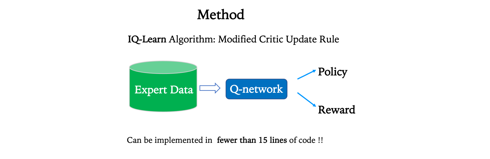
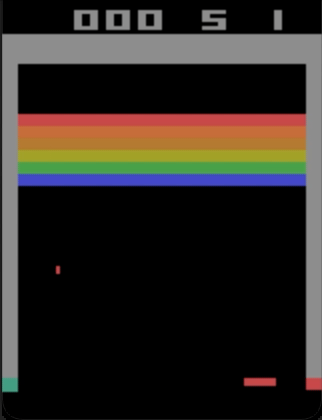
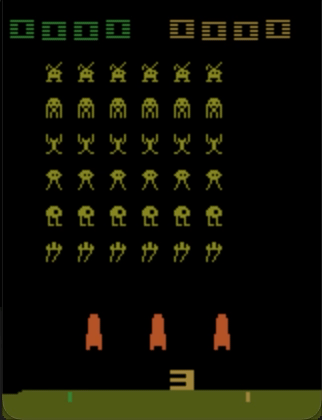
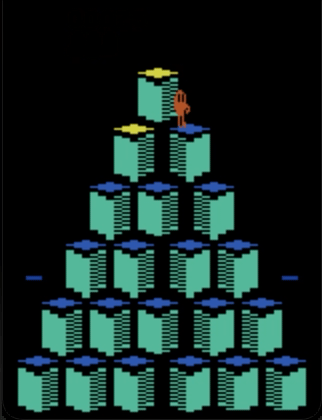
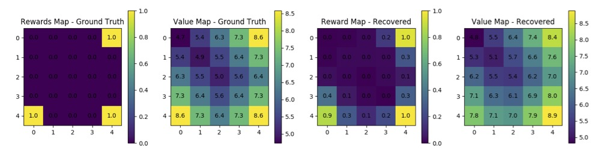

# Inverse Q-Learning (IQ-Learn)
Official code base for **[IQ-Learn: Inverse soft-Q Learning for Imitation](https://arxiv.org/abs/2106.12142)**, ***NeurIPS '21 Spotlight*** 

**IQ-Learn** is an easy-to-use algorithm that's a drop-in replacement to methods like Behavior Cloning and GAIL, to boost your imitation learning pipelines! \
Update: **IQ-Learn** was recently used to create the **best AI agent for playing Minecraft**. Placing **#1** in *NeurIPS MineRL Basalt Challenge* using only human demos (Overall Leaderboard Rank **#2**)

#

[**[Project Page](https://div99.github.io/IQ-Learn)**]

<a href="https://div99.github.io/IQ-Learn">

</a>

We introduce **Inverse Q-Learning (IQ-Learn)**, a **state-of-the-art** novel framework for Imitation Learning (IL), that directly learns **soft-Q** functions from expert data. IQ-Learn enables *non-adverserial* imitation learning, working on both offline and online IL settings. It is performant even with *very sparse* expert data, and scales to complex image-based environments, surpassing prior methods by more than **3x**. It is very simple to implement requiring **~15 lines of code** on top of existing RL methods.

Inverse Q-Learning is theoretically equivalent to *Inverse Reinforcement learning*, i.e. learning rewards from expert data. However, it is much more powerful in practice. It admits very simple non-adverserial training and works on complete offline IL settings (without any access to the environment), greatly exceeding Behavior Cloning.

**IQ-Learn** is the successor to Adversarial Imitation Learning methods like [GAIL](https://arxiv.org/abs/1606.03476) (coming from the same lab).\
It extends the theoretical framework for Inverse RL to non-adverserial and scalable learning, for the *first-time* showing guaranteed convergence.


### Citation
```
@inproceedings{garg2021iqlearn,
title={IQ-Learn: Inverse soft-Q Learning for Imitation},
author={Divyansh Garg and Shuvam Chakraborty and Chris Cundy and Jiaming Song and Stefano Ermon},
booktitle={Thirty-Fifth Conference on Neural Information Processing Systems},
year={2021},
url={https://openreview.net/forum?id=Aeo-xqtb5p}
}
```

<!-- ## Introduction

In many sequential decision-making problems (e.g., robotics control, game playing, sequential prediction), human or expert data is available containing useful information about the task. However, imitation learning (IL) from a small amount of expert data can be challenging in high-dimensional environments with complex dynamics. Behavioral cloning is a simple method that is widely used due to its simplicity of implementation and stable convergence but doesn't utilize any information involving the environment's dynamics. Many existing methods that exploit dynamics information are difficult to train in practice due to an adversarial optimization process over reward and policy approximators or biased, high variance gradient estimators. 

We introduce a method for dynamics-aware IL which avoids adversarial training by *learning a single Q-function*, implicitly representing both reward and policy. On standard benchmarks, the implicitly learned rewards show a high positive correlation with the ground-truth rewards, illustrating our method can also be used for inverse reinforcement learning (IRL). Our method, **Inverse soft-Q learning (IQ-Learn)** obtains **state-of-the-art results in offline and online imitation learning** settings, significantly outperforming existing methods both in the number of required environment interactions and scalability in high-dimensional spaces, often by more than **3x**. -->

## Key Advantages

✅  Drop-in replacement to Behavior Cloning \
✅  Non-adverserial online IL (Successor to [GAIL](https://arxiv.org/abs/1606.03476) & [AIRL](https://arxiv.org/abs/1710.11248)) \
✅  Simple to implement  \
✅  Performant with very sparse data (single expert demo) \
✅  Scales to Complex  Image Envs (SOTA on Atari and playing Minecraft) \
✅  Recover rewards from envs

## Usage

To install and use IQ-Learn check the instructions provided in the [iq_learn](iq_learn) folder.

## Imitation 
**Reaching human-level performance on Atari with pure imitation:**

<p float="left">


</p>
<p float="left">


</p>

## Rewards
Recovering environment rewards on GridWorld:




## Questions
Please feel free to email us if you have any questions. 

Div Garg ([divgarg@stanford.edu](mailto:divgarg@stanford.edu?subject=[GitHub]%IQ-Learn))
