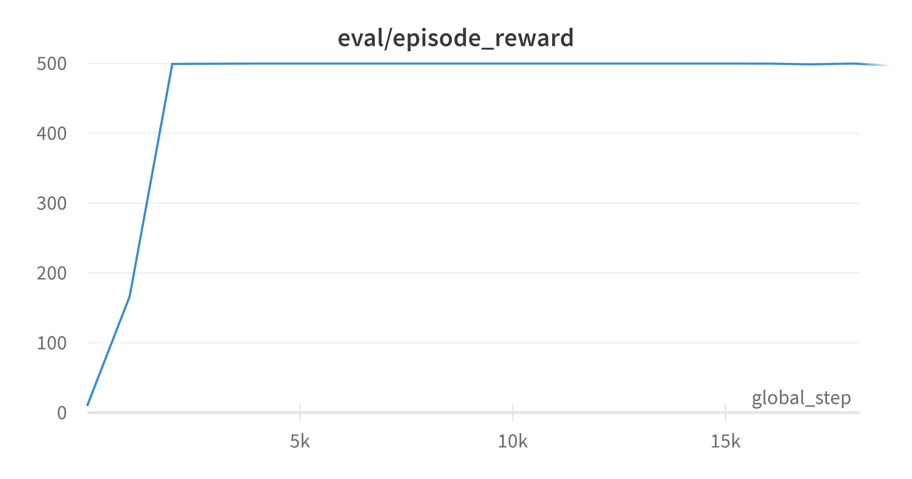
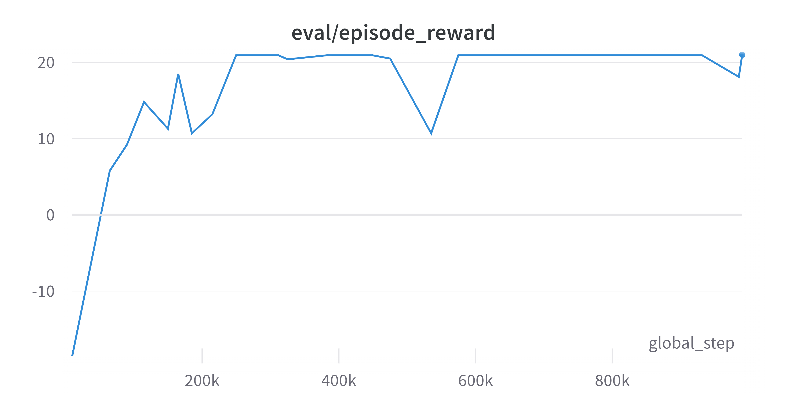
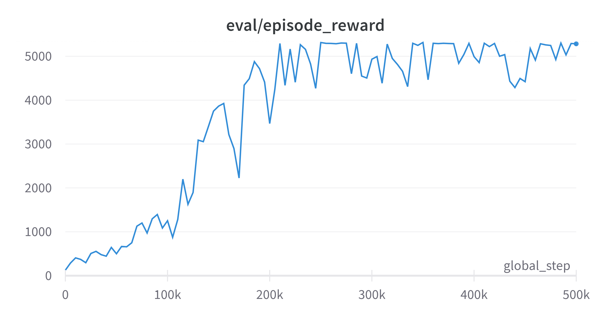

# Inverse Q-Learning (IQ-Learn)

## SOTA framework for non-adversarial Imitation Learning

IQ-Learn enables very fast, scalable and stable imitation learning.
Our IQ-Learn algorithm is present in `iq.py`. This file can be used standalone to add **IQ** to your IL & RL projects. 

IQ-Learn can be implemented on top of most existing RL methods (off-policy & on-policy) by changing the critic update loss to our proposed `iq_loss`. <br>
(IQ has been successfully tested to work with Q-Learning, SAC, PPO, DDPG and Decision Transformer agents).

### Update:
 
 - Added IQ-Learn results on Humanoid-v2
 - Added support for DM Control environments
 - Released `expert_generation` script to generate your own experts from trained RL agents for new environments.

## Requirement

- pytorch (>= 1.4)
- gym
- wandb
- tensorboardX
- hydra-core=1.0 (>= 1.1 is incompatible currently)

## Installation

- Make a conda environment and install dependencies: `pip install -r requirements.txt`
- Setup wandb project to log and visualize metrics
- (Optional) Download expert datasets for Atari environments from [GDrive](https://drive.google.com/file/d/1wKdMi10_X0oV4URdkv8JSCY0rRB8iBFq/view?usp=sharing)

## Examples

We show some examples that push the boundaries of imitation learning using IQ-Learn:

### 1. CartPole-v1 using 1 demo subsampled 20 times with fully *offline* imitation  

```
python train_iq.py agent=softq method=iq env=cartpole expert.demos=1 expert.subsample_freq=20 agent.init_temp=0.001 method.chi=True method.loss=value_expert
```

IQ-Learn is the only method thats reaches the expert env reward of **500** (requiring only 3k training steps and less than 30 secs!!)

 

### 2. Playing Pong at human performance

```
python train_iq.py agent=softq env=pong agent.init_temp=1e-3 method.loss=value_expert method.chi=True seed=0 expert.demos=30
```

Again, IQ-Learn is the only method thats reaches the expert env reward of **21** <br>
(we find better hyperparams compared to the original paper)

 


### 3. Controlling a Humanoid with imitation of a single expert

```
python train_iq.py env=humanoid agent=sac expert.demos=1 method.loss=v0 method.regularize=True agent.actor_lr=3e-05 seed=0 agent.init_temp=1
```

IQ-Learn learns to control a full humanoid at expert performance using a single demonstration reaching the expert env reward of **5300** <br>

 

## Instructions
We show example code for training Q-Learning and SAC agents with **IQ-Learn** in `train_iq`.py. We make minimum modifications to original RL training code present in `train_rl`.py and simply change the critic loss function.
<!-- Our training code is present in `train_iq.py` which implements **IQ-Learn** on top of DQN/SAC RL agents by simply changing the Q-function update rule. RL training code is in `train_rl.py`. <br> IQ-Learn simplify modifies the loss function for the critic network, compared to vanilla RL. -->

- To reproduce our Offline IL experiments, see `scripts/run_offline.sh`
- To reproduce our Mujoco experiments, see `scripts/run_mujoco.sh`
- To reproduce Atari experiments, see `scripts/run_atari.sh`
- To visualize our recovered state-only rewards on a toy Point Maze environment: 
    `python -m vis.maze_vis env=pointmaze_right eval.policy=pointmaze agent.init_temp=1 agent=sac.q_net._target_=agent.sac_models.DoubleQCritic`. <br>
    Reward visualizations are saved in `vis/outputs` directory

## Contributions

Contributions are very welcome. If you know how to make this code better, please open an issue. If you want to submit a pull request, please open an issue first. 

## License

The code is made available for academic, non-commercial usage. Please see the [LICENSE](LICENSE.md) for the licensing terms of IQ-Learn for commercial use and running it on your robots/creating new AI agents.

For any inquiry, contact: Div Garg ([divgarg@stanford.edu](mailto:divgarg@stanford.edu?subject=[GitHub]%IQ-Learn))


